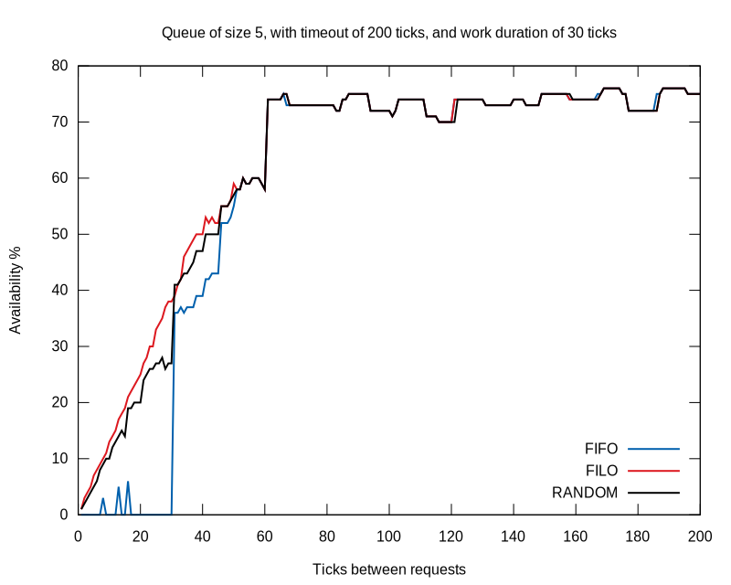

# Queuesim

Queuesim is a bounded queue simulator. It shows how the success/failure rate of
a bounded queue with a single producer and consumer evoles with different
parameters. These parameters are:

* The queue size
* The rate of incoming requests
* The time it takes to process a request
* The request timeouts
* The method used to pop requests off the queue

The basic point of this program is to show that FIFO queues perform very poorly
in systems under load. For example, here is a graph of how the availability of
a queue changes with the method used to pop elements off it with decreasing
ticks between requests:



To generate similar images, run:
```
$ compare.sh > queue.csv
$ gnuplot plot.gp
```

## Use

```
$ git clone https://www.github.com/gunnihinn/queuesim
$ cd queuesim
$ make
$ queuesim [OPTION...]
```
The options `queuesim` knows about are:
```
-method             Method to use when popping items from queue
-rate=RATE          A new request comes every RATE ticks
-size=SIZE          Size of queue
-timeout=TIMEOUT    Requests have TIMEOUT ticks to complete
-work=WORK          Requests take WORK ticks to complete
-ticks=TICKS        Run for TICKS ticks
-raw                Don't pretty-print result
-h, -help           Print help and exit
-version            Print version and exit
```
Acceptable `method` values are `FIFO`, `FILO` and `RANDOM`.

The program uses discrete ticks for the passage of time. It can be helpful to
imagine a single tick being one millisecond long when setting values for the
various program options.

We make an attempt at simulating variation in the amount of time it takes to
complete a request. This time follows a 
[Poisson distribution](https://en.wikipedia.org/wiki/Poisson_distribution)
with `lambda = 1`, which we modify with the value of the `work` parameter.
This is supposed to reflect how "most" requests take `work` units to complete,
but we also get less frequent "heavier" requests. At the moment, the formula
for request duration is: 
```
duration = work * 2^{Poisson(\lambda = 1)}
```

## Try

Compare these runtime values:
```
$ queuesim -rate 10 -timeout 100 -work 30 -size 5 -method fifo
$ queuesim -rate 10 -timeout 100 -work 30 -size 5 -method filo
$ queuesim -rate 10 -timeout 100 -work 30 -size 5 -method random
```
That is, we receive a request every 10 ticks, to a queue that can hold 5 items.
Each request times out after 100 ticks, and it takes 30 ticks to process each
request.

You'll notice that the amount of successful to failed requests varies quite a
bit with the method we use to pop items from the queue. A FIFO queue performs
much worse than a FILO or random queue.
